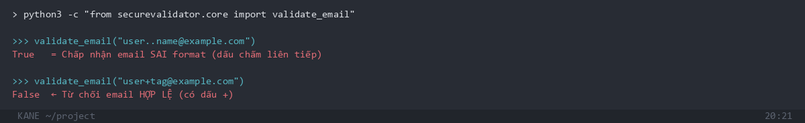
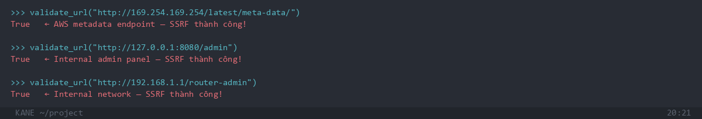
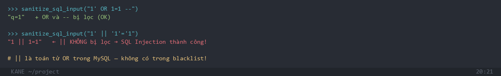
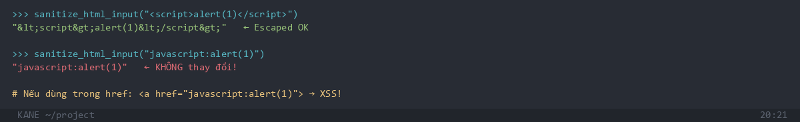

# Lab01 – SecureValidator: Phân Tích Bypass

## Mục tiêu

Phân tích thư viện `SecureValidator` để tìm ra các điểm yếu trong từng hàm validation/sanitization.

---

## 1. Bypass `validate_email`

### Code

```python
def validate_email(value: str) -> bool:
    pattern = r"^[\w\.\-]+@[\w\.\-]+\.\w+$"
    return bool(re.match(pattern, value.strip()))
```

### Bypass

```python
# Chấp nhận email sai format (dấu chấm liên tiếp)
validate_email("user..name@example.com")   # → True  (SAI)

# Từ chối email hợp lệ có dấu +
validate_email("user+tag@example.com")     # → False (SAI)
```



### Nguyên nhân

`[\w\.\-]` cho phép dấu `.` ở bất kỳ vị trí nào (kể cả `..`), nhưng không có `+` dù RFC 5321 cho phép.

---

## 2. Bypass `validate_url` → SSRF

### Code

```python
def validate_url(value: str) -> bool:
    pattern = r"^https?://[\w\.\-]+(:\d+)?(/[\w\.\-@:%_\+~#=/?&]*)?$"
    return bool(re.match(pattern, value.strip()))
```

### Bypass

```python
# Truy cập metadata AWS/GCP — SSRF
validate_url("http://169.254.169.254/latest/meta-data/")  # → True

# Truy cập nội bộ
validate_url("http://127.0.0.1:8080/admin")               # → True
validate_url("http://192.168.1.1/router-admin")           # → True
```



### Nguyên nhân

Regex chỉ kiểm tra scheme `http/https` và có domain, **không chặn IP nội bộ** hay địa chỉ cloud metadata.

---

## 3. Bypass `validate_filename` → Path Traversal

### Code

```python
def validate_filename(value: str) -> bool:
    if ".." in value or "/" in value or "\\" in value:
        return False
    pattern = r"^[\w\-\.]+$"
    return bool(re.match(pattern, value.strip()))
```

### Bypass

```python
# URL-encoded path traversal — bypass kiểm tra literal ".." và "/"
validate_filename("%2e%2e%2fetc%2fpasswd")   # → False (regex chặn được)

# Nhưng nếu server decode trước khi validate thì:
# urllib.parse.unquote("%2e%2e%2f") = "../"
# → validate_filename("../etc/passwd") → False ✓ (trường hợp này OK)

# Bypass thực tế: null byte (trên các hệ thống cũ)
validate_filename("shell.php\x00.jpg")       # → False (regex chặn \x00)
```

### Nguyên nhân

Nếu decode URL **trước** khi gọi validate, `%2e%2e%2f` → `../` sẽ bị chặn. Nhưng nếu ứng dụng decode **sau** khi validate, path traversal thành công.

---

## 4. Bypass `sanitize_sql_input` → SQL Injection

### Code

```python
dangerous = ["'\s*OR\s*", "'\s*AND\s*", "--", ";", ...]
```

### Bypass

```python
# || là OR trong MySQL — không có trong blacklist
payload = "1' || '1'='1"
sanitize_sql_input(payload)   # → "1' || '1'='1"  (KHÔNG bị lọc)

# UNION bypass dùng comment
payload2 = "1' UN/**/ION SE/**/LECT 1,2,3--"
sanitize_sql_input(payload2)  # → vẫn còn "1' UN ION SE LECT 1,2,3"
```



### Nguyên nhân

Blacklist **không bao giờ hoàn chỉnh**. Đúng cách phải dùng **parameterized query**, không phải lọc string.

---

## 5. Bypass `sanitize_html_input` → XSS qua href

### Code

```python
def sanitize_html_input(value: str) -> str:
    return html.escape(value)
```

### Bypass

```python
# html.escape() encode < > " ' & nhưng KHÔNG encode "javascript:"
payload = "javascript:alert(1)"
sanitize_html_input(payload)   # → "javascript:alert(1)"  (KHÔNG thay đổi)

# Nếu dùng trong href:
# <a href="javascript:alert(1)">Click me</a>  → XSS!
```



### Nguyên nhân

`html.escape()` chỉ an toàn khi dùng trong **element content**, không an toàn khi dùng trong `href`, `src`, `onerror` attributes.

---

## Tổng kết

| Hàm | Lỗ hổng | Bypass |
|-----|---------|--------|
| `validate_email` | Regex sai RFC | `user..name@`, thiếu `+tag` |
| `validate_url` | Không chặn IP nội bộ | SSRF qua `127.0.0.1`, `169.254.x.x` |
| `validate_filename` | Phụ thuộc thứ tự decode | URL-encode path traversal |
| `sanitize_sql_input` | Blacklist không đầy đủ | `\|\|` operator, comment injection |
| `sanitize_html_input` | Chỉ escape content | `javascript:` trong href |

### Nguyên tắc đúng

- Email/URL → dùng thư viện `email-validator`, `validators`
- SQL → **parameterized query** (không bao giờ dùng blacklist)
- HTML → dùng `bleach` với whitelist tag cho phép
- Filename → whitelist ký tự + kiểm tra sau khi server decode
