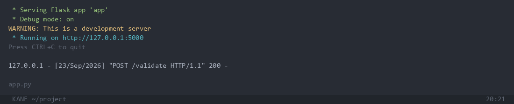
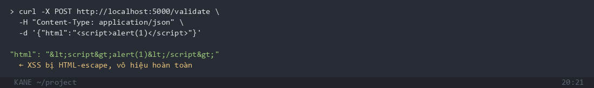
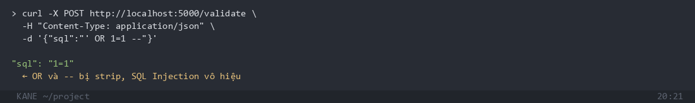
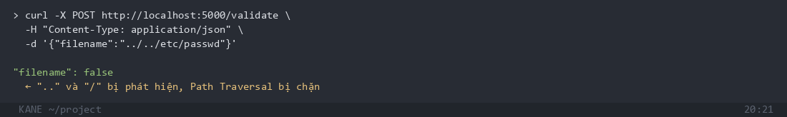
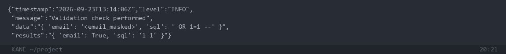

# Lab02 – SecureLogger + SecureValidator: Exploit & Demo

## Mục tiêu

Chứng minh hệ thống phát hiện và vô hiệu hóa các tấn công đầu vào: XSS, SQL Injection, Path Traversal, đồng thời che PII trong log.

---

## Cài đặt & Chạy

```bash
cd Lab03
pip install -r requirements.txt
python app.py
```



---

## Exploit 1 – XSS (Cross-Site Scripting)

**Payload:** `<script>alert(1)</script>`



`<script>` bị HTML-escape thành `&lt;script&gt;` → **XSS vô hiệu hoàn toàn**.

---

## Exploit 2 – SQL Injection

**Payload:** `' OR 1=1 --`



`' OR ... --` bị strip, chỉ còn `1=1` → **SQL Injection vô hiệu**.

---

## Exploit 3 – Path Traversal

**Payload:** `../../etc/passwd`



`..` và `/` bị phát hiện → filename **bị từ chối (false)**.

---

## PII Masking trong Log

Email trong request **không bao giờ được ghi thô** vào log:



`attacker@evil.com` → `<email_masked>` trong `secure.log`.

---

## Kết luận

| Tấn công | Kết quả |
|----------|---------|
| XSS `<script>` | HTML-escaped → vô hiệu |
| SQL Injection `' OR 1=1` | Strip keywords → vô hiệu |
| Path Traversal `../../etc/passwd` | filename = false |
| PII trong log | Auto-masked `<email_masked>` |
| Log tampering | SHA-256 signature trong `.sig` |
