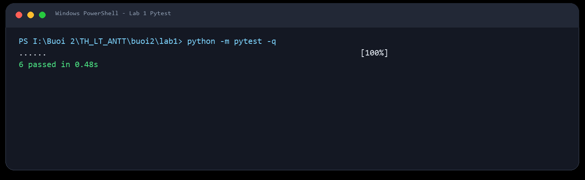
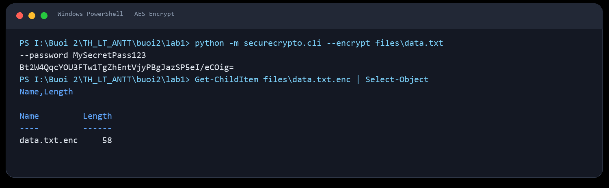
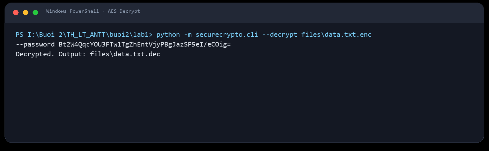
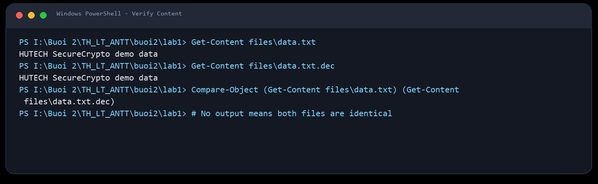
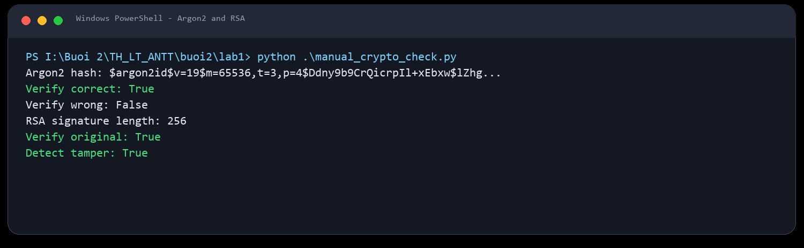
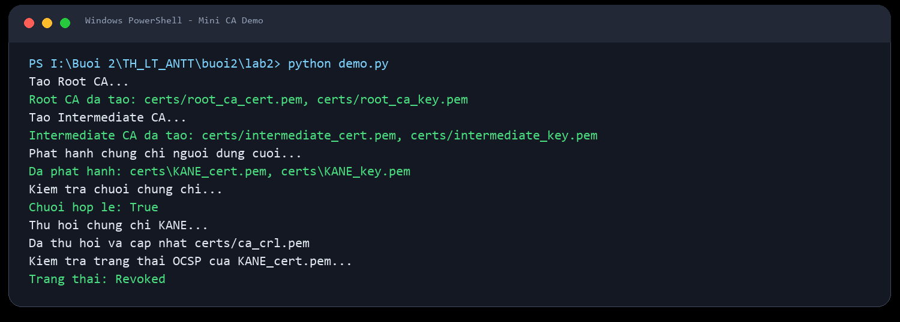
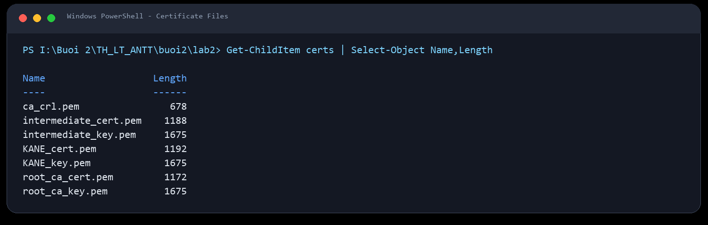
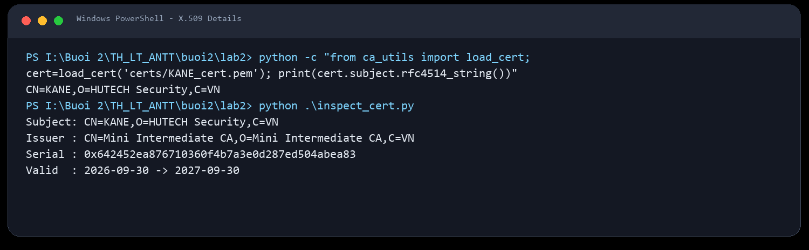
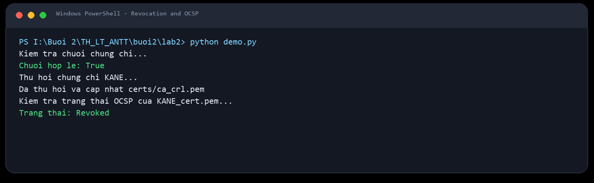

# Bao cao thuc hanh Buoi 2: Ma hoa du lieu va trien khai PKI

- Sinh vien: KANE
- Mon hoc: Lap trinh an toan / Bao mat ung dung

---

## 1. Cau truc thu muc

```text
buoi2/
├── README.md
├── images/
│   ├── lab1_step1_pytest.png
│   ├── lab1_step2_cli_encrypt.png
│   ├── lab1_step3_cli_decrypt.png
│   ├── lab1_step4_verify_content.png
│   ├── lab1_step5_argon2_rsa.png
│   ├── lab2_step1_demo_cli.png
│   ├── lab2_step2_dir_certs.png
│   ├── lab2_step3_cert_details.png
│   └── lab2_step4_ocsp.png
├── lab1/     # SecureCrypto - AES, Argon2, RSA, CLI, API, GUI
└── lab2/     # Mini Certificate Authority - Root CA, Intermediate CA, CRL, OCSP
```

---

## 2. Lab 1 - SecureCrypto

### 2.1. Muc tieu

Xay dung bo cong cu mat ma ung dung:

- Ma hoa va giai ma file bang **AES-256-GCM**.
- Phai sinh khoa bang **PBKDF2HMAC-SHA256** voi salt ngau nhien.
- Bam mat khau bang **Argon2id**.
- Sinh cap khoa, ky so va xac thuc chu ky bang **RSA-2048 + SHA-256**.
- Ho tro CLI, Flask API va Tkinter GUI.

### 2.2. Chay unit test

```powershell
cd buoi2\lab1
python -m pytest -q
```



Ket qua: 6 test pass, bao gom ma hoa/giai ma AES, hash password Argon2 va RSA sign/verify.

### 2.3. Ma hoa file bang CLI

```powershell
python -m securecrypto.cli --encrypt files\data.txt --password MySecretPass123
```



Lenh tao file `files/data.txt.enc` va in ra khoa AES dang Base64 de su dung khi giai ma.

### 2.4. Giai ma file bang CLI

```powershell
python -m securecrypto.cli --decrypt files\data.txt.enc --password <Base64_Key>
```



Ket qua giai ma duoc ghi vao `files/data.txt.dec`.

### 2.5. Doi soat noi dung



Noi dung file sau giai ma trung khop voi file ban dau, chung minh qua trinh ma hoa/giai ma khong lam sai lech du lieu.

### 2.6. Kiem thu Argon2 va RSA

```powershell
python .\manual_crypto_check.py
```



Ket qua cho thay:

- Mat khau dung xac thuc `True`.
- Mat khau sai xac thuc `False`.
- Chu ky RSA hop le voi du lieu goc.
- Du lieu bi sua se bi phat hien.

---

## 3. Lab 2 - Mini Certificate Authority

### 3.1. Muc tieu

Xay dung he thong PKI don gian:

- Tao **Root CA** tu ky.
- Tao **Intermediate CA** duoc Root CA ky.
- Phat hanh chung chi end-entity cho `KANE`.
- Kiem tra chuoi tin cay `User Cert -> Intermediate CA -> Root CA`.
- Thu hoi chung chi bang CRL va kiem tra trang thai kieu OCSP.

### 3.2. Chay demo CLI

```powershell
cd buoi2\lab2
python demo.py
```



Demo tao Root CA, Intermediate CA, phat hanh chung chi KANE, verify chain, thu hoi chung chi va kiem tra trang thai `Revoked`.

### 3.3. Kiem tra cac file chung chi



Thu muc `certs/` duoc tao khi chay demo va gom khoa rieng, chung chi X.509 va file CRL.

### 3.4. Xem chi tiet chung chi

```powershell
python .\inspect_cert.py
```



Chung chi nguoi dung co `Subject` la `CN=KANE,O=HUTECH Security,C=VN` va duoc ky boi `Mini Intermediate CA`.

### 3.5. Thu hoi va kiem tra OCSP



Sau khi thu hoi, serial cua chung chi duoc ghi vao `ca_crl.pem`; ham kiem tra trang thai tra ve `Revoked`.

---

## 4. Bang tong hop test

| STT | Kich ban | Thanh phan | Ket qua |
| --- | --- | --- | --- |
| 1 | Ma hoa file | AES-256-GCM + PBKDF2 | PASS |
| 2 | Giai ma va doi soat noi dung | AES-GCM auth tag | PASS |
| 3 | Bam va verify mat khau | Argon2id | PASS |
| 4 | Ky so | RSA-2048 + SHA-256 | PASS |
| 5 | Phat hien du lieu bi sua | RSA verify | PASS |
| 6 | Tao Root CA | X.509 self-signed | PASS |
| 7 | Tao Intermediate CA | X.509 signed by Root CA | PASS |
| 8 | Phat hanh chung chi user | X.509 end-entity | PASS |
| 9 | Verify certificate chain | PKI trust chain | PASS |
| 10 | Thu hoi chung chi | CRL / OCSP status | PASS |

---

## 5. Lenh chay nhanh

```powershell
cd buoi2\lab1
python -m pytest -q
python -m securecrypto.cli --encrypt files\data.txt --password MySecretPass123

cd ..\lab2
python -m pytest -q
python demo.py
```
