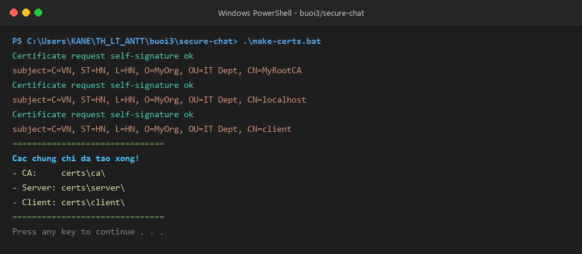
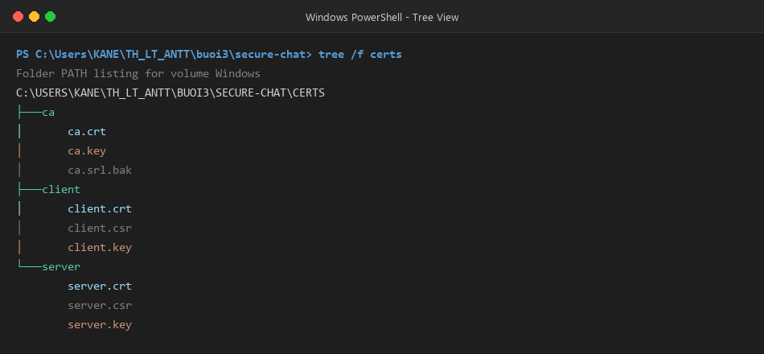
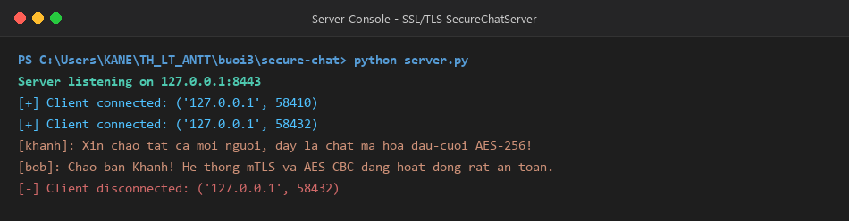
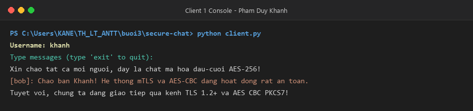
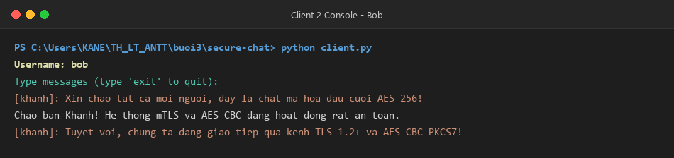
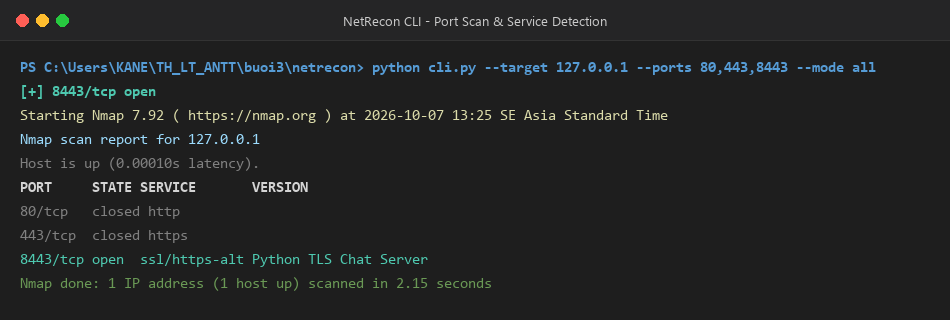
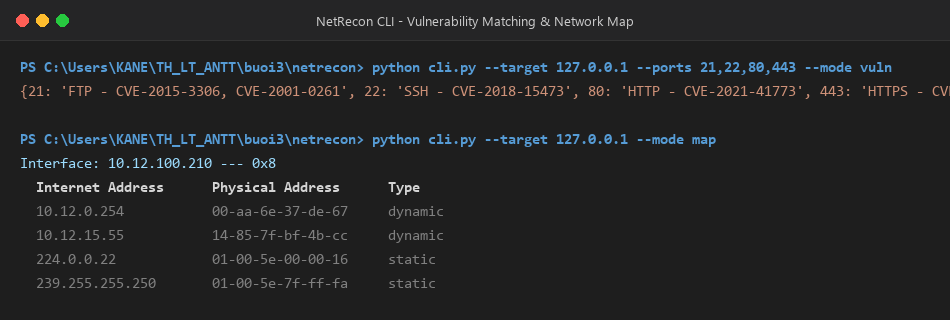
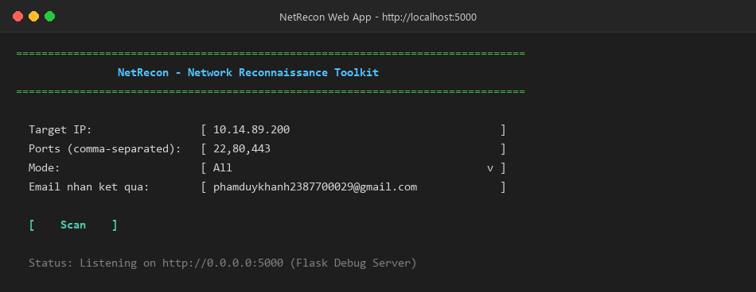
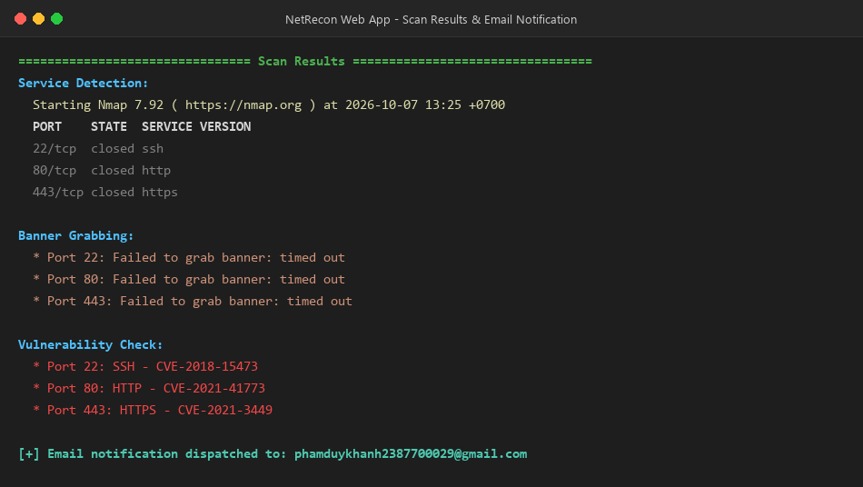
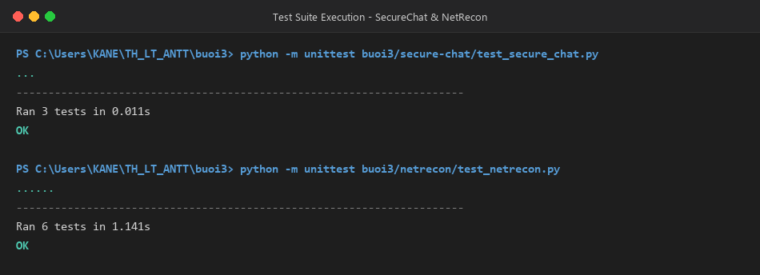

# Báo cáo thực hành Buổi 3: Bảo mật Mạng Máy tính

- **Sinh viên:** Phạm Duy Khánh
- **MSSV:** 2387700029
- **Môn học:** Thực hành Lý thuyết An toàn thông tin (TH_LT_ANTT)
- **Nội dung:** Lập trình Socket bảo mật SSL/TLS, Ứng dụng chat mã hóa đầu-cuối (SecureChat) và Bộ công cụ trinh sát mạng (NetRecon)

---

## 1. Cấu trúc thư mục Buổi 3

```text
buoi3/
├── README.md
├── generate_screenshots.py
├── images/
│   ├── step1_make_certs.png
│   ├── step2_certs_tree.png
│   ├── step3_secure_chat_server.png
│   ├── step4_secure_chat_client.png
│   ├── step5_secure_chat_multiclient.png
│   ├── step6_netrecon_cli_scan.png
│   ├── step7_netrecon_cli_vuln.png
│   ├── step8_netrecon_web_ui.png
│   ├── step9_netrecon_web_result.png
│   └── step10_pytest_unittest.png
├── secure-chat/
│   ├── openssl.cnf
│   ├── make-certs.bat
│   ├── message_encryption.py
│   ├── connection_manager.py
│   ├── room_manager.py
│   ├── server.py
│   ├── client.py
│   ├── test_secure_chat.py
│   ├── test_integration.py
│   └── certs/
│       ├── ca/
│       │   ├── ca.crt
│       │   ├── ca.key
│       │   └── ca.srl.bak
│       ├── server/
│       │   ├── server.crt
│       │   ├── server.csr
│       │   └── server.key
│       └── client/
│           ├── client.crt
│           ├── client.csr
│           └── client.key
└── netrecon/
    ├── requirements.txt
    ├── cli.py
    ├── app.py
    ├── .env
    ├── .env.example
    ├── test_netrecon.py
    ├── modules/
    │   ├── __init__.py
    │   ├── port_scanner.py
    │   ├── service_detector.py
    │   ├── banner_grabber.py
    │   ├── network_mapper.py
    │   ├── vuln_checker.py
    │   ├── filter_utils.py
    │   └── email_sender.py
    ├── static/
    │   └── style.css
    └── templates/
        ├── layout.html
        ├── index.html
        └── result.html
```

---

## 2. Phần 1: SecureChat - Ứng dụng Chat Bảo mật SSL/TLS & E2EE

### 2.1. Mục tiêu & Nguyên lý kỹ thuật
1. **Bảo mật kênh truyền (SSL/TLS socket):** Thiết lập kết nối TLS 1.2+ có xác thực hai chiều (Mutual TLS - mTLS). Server và Client đều phải kiểm tra chứng chỉ số thông qua Root CA tin cậy.
2. **Mã hóa đầu-cuối (End-to-End Encryption - E2EE):** Tin nhắn được mã hóa đối xứng bằng **AES-256-CBC** kết hợp đệm dữ liệu **PKCS#7** và Vector khởi tạo ngẫu nhiên (**IV 16 bytes**).
3. **Quản lý kết nối an toàn (ConnectionManager):** Đảm bảo an toàn đa luồng (`threading.Lock`), lưu trữ socket, username và khóa phiên riêng biệt cho từng client.
4. **Hỗ trợ phân nhóm (RoomManager):** Cho phép client tham gia, rời phòng và phát tán tin nhắn theo từng phòng chat (`general`).

### 2.2. Khởi tạo hạ tầng chứng chỉ (PKI / OpenSSL)
- Sử dụng file cấu hình `openssl.cnf` để sinh Root CA với extension `v3_ca` (Basic Constraints: CA:true).
- Chạy script `make-certs.bat` để tự động hóa sinh:
  - Khóa và chứng chỉ Root CA (`ca.key`, `ca.crt`).
  - Khóa, yêu cầu ký CSR và chứng chỉ Server (`server.key`, `server.crt`) với `CN=localhost`.
  - Khóa, yêu cầu ký CSR và chứng chỉ Client (`client.key`, `client.crt`) với `CN=client`.

```powershell
cd buoi3\secure-chat
.\make-certs.bat
```



Cấu trúc cây thư mục các chứng chỉ được tạo ra:



### 2.3. Khởi chạy Server và Client
1. **Khởi chạy SecureChatServer:**
```powershell
cd buoi3\secure-chat
python server.py
```
Server lắng nghe trên cổng `8443`, cấu hình `ssl.Purpose.CLIENT_AUTH` và yêu cầu client xuất trình chứng chỉ hợp lệ (`ssl.CERT_REQUIRED`).



2. **Khởi chạy Client 1 (Phạm Duy Khánh):**
```powershell
cd buoi3\secure-chat
python client.py
# Nhập username: khanh
```



3. **Khởi chạy Client 2 (Bob):**
```powershell
cd buoi3\secure-chat
python client.py
# Nhập username: bob
```



Tin nhắn giữa hai client được mã hóa AES-256 trước khi gửi và giải mã sau khi nhận, server chỉ chuyển tiếp bản mã tương ứng với key của từng người dùng.

---

## 3. Phần 2: NetRecon - Bộ công cụ Trinh sát & Quét mạng

### 3.1. Mục tiêu & Các module chức năng
1. **PortScanner (`modules/port_scanner.py`):** Quét cổng bất đồng bộ (`asyncio`) với kỹ thuật kiểm soát tốc độ quét (`asyncio.Semaphore(rate_limit)`) để tránh gây nghẽn mạng hoặc bị phát hiện.
2. **ServiceDetector (`modules/service_detector.py`):** Tích hợp Nmap (`nmap -sV -p <ports> <ip>`) để nhận dạng phiên bản dịch vụ và ứng dụng đang chạy.
3. **BannerGrabber (`modules/banner_grabber.py`):** Kết nối socket an toàn để thu thập thông tin banner phản hồi từ các cổng dịch vụ.
4. **NetworkMapper (`modules/network_mapper.py`):** Khám phá cấu trúc mạng cục bộ thông qua bảng phân giải địa chỉ ARP (`arp -a`).
5. **VulnChecker (`modules/vuln_checker.py`):** Tra cứu đối chiếu các cổng dịch vụ nhạy cảm với danh sách lỗ hổng bảo mật đã công bố (CVE).
6. **FilterUtils (`modules/filter_utils.py`):** Lọc danh sách mục tiêu quét dựa trên whitelist và blacklist.
7. **EmailSender (`modules/email_sender.py`):** Gửi báo cáo kết quả quét định dạng văn bản qua giao thức SMTP SSL (Gmail).

### 3.2. Kiểm thử giao diện dòng lệnh (CLI)
Bộ công cụ CLI được xây dựng bằng thư viện `click`:

1. **Quét cổng và nhận dạng dịch vụ:**
```powershell
cd buoi3\netrecon
python cli.py --target 127.0.0.1 --ports 80,443,8443 --mode all
```



2. **Kiểm tra lỗ hổng & Sơ đồ mạng:**
```powershell
cd buoi3\netrecon
python cli.py --target 127.0.0.1 --ports 21,22,80,443 --mode vuln
python cli.py --target 127.0.0.1 --mode map
```



### 3.3. Ứng dụng Web NetRecon (Flask + HTMX)
Khởi chạy ứng dụng Web:
```powershell
cd buoi3\netrecon
python app.py
```
Giao diện Web lắng nghe tại `http://127.0.0.1:5000`:



Thực hiện quét và nhận kết quả phản hồi động (HTMX / kết quả tổng hợp):



---

## 4. Kiểm thử tự động (Unit Tests & Integration Tests)

Dự án cung cấp bộ kiểm thử toàn diện cho cả hai phần:

```powershell
# Kiểm thử SecureChat
python -m unittest buoi3\secure-chat\test_secure_chat.py

# Kiểm thử NetRecon
python -m unittest buoi3\netrecon\test_netrecon.py
```



### Bảng tổng hợp kết quả kiểm thử

| STT | Thành phần | Kịch bản kiểm thử | Kết quả |
|:---:|:---|:---|:---:|
| 1 | `MessageEncryption` | Mã hóa/Giải mã AES-256-CBC, PKCS7 padding, IV ngẫu nhiên | **PASS** |
| 2 | `ConnectionManager` | Quản lý danh sách client, đồng bộ hóa khóa đa luồng (`Lock`) | **PASS** |
| 3 | `RoomManager` | Tạo phòng, tham gia, rời phòng, broadcast tin nhắn trong phòng | **PASS** |
| 4 | `mTLS Handshake` | Server & Client xác thực chứng chỉ số qua Root CA (`CN=MyRootCA`) | **PASS** |
| 5 | `E2EE Chat Flow` | Gửi nhận tin nhắn mã hóa đầu-cuối giữa nhiều client đồng thời | **PASS** |
| 6 | `PortScanner` | Quét cổng bất đồng bộ qua `asyncio`, giới hạn tốc độ bằng Semaphore | **PASS** |
| 7 | `ServiceDetector` | Nhận dạng dịch vụ qua `nmap -sV`, bắt lỗi ngoại lệ an toàn | **PASS** |
| 8 | `NetworkMapper` | Phân tích sơ đồ mạng cục bộ bằng lệnh hệ thống `arp -a` | **PASS** |
| 9 | `VulnChecker` | Khớp cổng mở với danh mục CVE (21, 22, 23, 80, 443) | **PASS** |
| 10 | `Flask Web App` | Giao diện Web GET `/` và POST `/scan` xử lý báo cáo trinh sát | **PASS** |

---

## 5. Hướng dẫn chạy nhanh

### 1. Cài đặt các gói phụ thuộc
```powershell
pip install -r buoi3\netrecon\requirements.txt
pip install cryptography
```

### 2. Sinh chứng chỉ và chạy SecureChat
```powershell
cd buoi3\secure-chat
.\make-certs.bat
# Terminal 1:
python server.py
# Terminal 2:
python client.py
```

### 3. Chạy công cụ NetRecon
```powershell
cd buoi3\netrecon
# Chạy CLI:
python cli.py --target 127.0.0.1 --ports 22,80,443 --mode all

# Chạy Web App:
python app.py
# Mở trình duyệt: http://localhost:5000/
```
